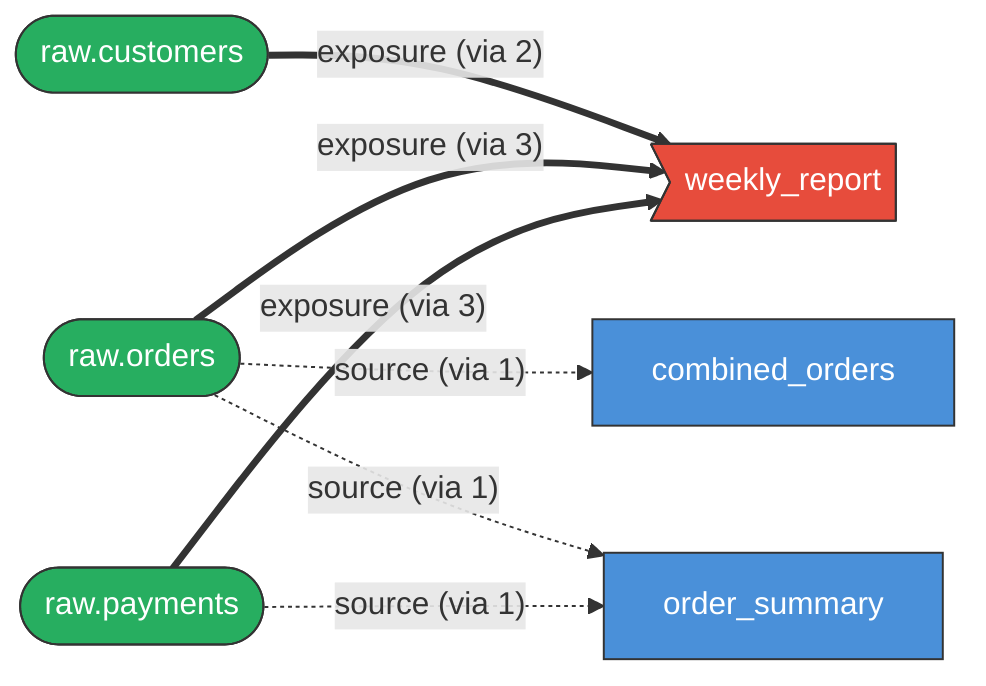
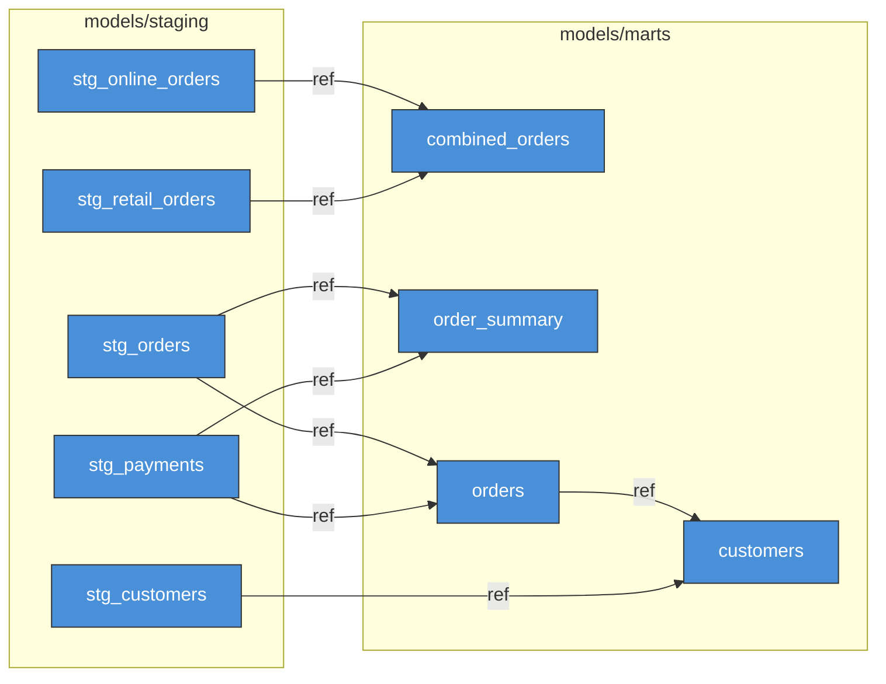
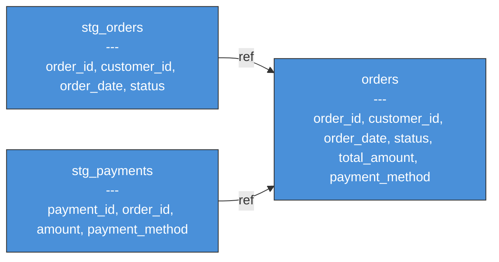
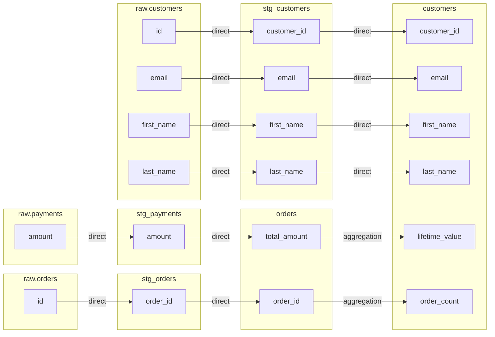
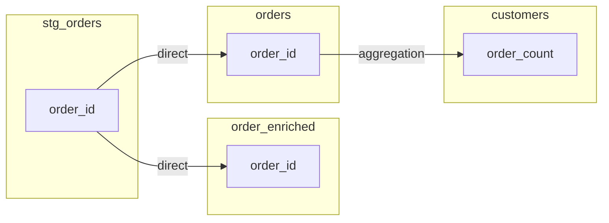

# dlin

[](https://crates.io/crates/dlin)
[](https://pypi.org/project/dlin-cli/)
[](https://deepwiki.com/eitsupi/dlin)

dbt model lineage CLI that parses SQL files directly. No `dbt compile`, no Python, no `manifest.json` (for model-level lineage).

Builds a dependency graph from `ref()` and `source()` calls in SQL. Designed for AI agents and CI pipelines.

Experimental column-level lineage (`dlin column upstream` / `dlin column downstream`) is also available. It requires `dbt compile` and `manifest.json`.

## Motivation

When I edited dbt models in VS Code, [dbt Power User](https://marketplace.visualstudio.com/items?itemName=innoverio.vscode-dbt-power-user) was my go-to companion for navigating lineage. AI agents have no such companion. I watched them `grep` through dbt projects to find model dependencies. It works, but they end up calling `grep` repeatedly and relying on fragile string matching to piece together `ref()` and `source()` relationships.

dlin is designed to fill that gap: a CLI tool that lets AI agents understand a dbt project's structure without falling back to `grep`. It is equally useful for humans, and its stdin/stdout interface makes it easy to combine with `jq`, `git diff`, and other CLI tools.

To replace `grep`, speed and size matter. dlin is a small, self-contained binary with no runtime dependencies. It parses SQL directly, evaluates common Jinja patterns without Python, parallelizes file I/O, and caches aggressively.

The key idea behind dlin is that finding the right models fast is what matters most. The hard part for agents is knowing which models to look at in the first place. dlin focuses on making model-level lineage as fast as possible, and also offers experimental column-level lineage for deeper analysis.

## Install

### Cargo (Rust)

```sh
cargo install dlin
```

### pip / uv (Python)

For convenience, dlin is also available as a Python package. The installed binary is native and does not require Python at runtime.

```sh
pip install dlin-cli   # or: uv tool install dlin-cli
```

### GitHub Releases

Pre-built binaries for Linux, macOS, and Windows are available on the [Releases](https://github.com/eitsupi/dlin/releases) page. You can also use the installer scripts:

macOS / Linux:

```sh
curl --proto '=https' --tlsv1.2 -LsSf https://github.com/eitsupi/dlin/releases/latest/download/dlin-installer.sh | sh
```

Windows (PowerShell):

```powershell
powershell -ExecutionPolicy Bypass -c "irm https://github.com/eitsupi/dlin/releases/latest/download/dlin-installer.ps1 | iex"
```

## Quick start

```sh
# Full lineage graph
dlin graph -p path/to/dbt/project

# Downstream impact analysis
dlin impact orders

# List models as JSON
dlin list -o json --json-fields unique_id,file_path

# Pipe changed files into lineage
git diff --name-only main | dlin graph -o json
```

## AI agent integration

No MCP server or tool configuration needed.
Just install dlin and add the following to your `AGENTS.md`, `CLAUDE.md`, or system prompt:

````md
## dbt project structure analysis

Use `dlin` to explore dbt model dependencies.
Do NOT grep/cat/find through SQL files.

```bash
dlin summary                                           # Project overview (start here)
dlin graph <model> -u 2 -d 1 -q                        # Upstream/downstream lineage
dlin impact <model>                                    # Downstream impact with severity
dlin list -o json --json-fields unique_id,sql_content  # Read SQL content
git diff --name-only main | dlin graph -q              # Lineage of changed files
```

For full option reference: `dlin --help`, `dlin graph --help`, etc.
````

The key line is **"Do NOT grep/cat/find through SQL files"** — without it, agents default to familiar tools. `dlin --help` is designed for tool discovery, so the prompt can stay minimal.

## Features

- **No dependencies for model lineage**: single binary, no Python, no `manifest.json`
- **Recursive upstream / downstream**: `-u N` / `-d N` to control traversal depth
- **Impact analysis with severity**: `dlin impact` scores downstream nodes and flags exposure reachability
- **Composable**: stdin accepts model names or file paths; pipe with `jq`, `dlin list`, `git diff`, etc.
- **Agent-friendly**: `--error-format json` emits structured `{"level","what","why","hint"}` on stderr; `--help` is designed for tool discovery
- **Column-level lineage** (experimental): traces columns across models with transformation classification; requires `dbt compile` and `manifest.json`

## Mermaid diagrams

dlin outputs Mermaid flowcharts that render natively on GitHub, GitLab, Notion, and other Markdown environments.

### Simplified graphs with `--collapse`

Automatically remove intermediate nodes to see just the endpoints (nodes with no predecessors or no successors); everything in between becomes transitive "(via N)" edges:

```sh
# Collapse intermediate models — only endpoints remain
dlin graph --collapse -o mermaid

# Focal mode: keep only sources, exposures, and specified focus models
# (ignores BFS window pseudo-endpoints — ideal with -u/-d limits)
dlin graph orders --collapse=focal -u 3 -o mermaid
```



Positional focus models are always preserved during collapse, so `dlin graph orders --collapse` keeps `orders` even if it would otherwise be intermediate.

### Pipe to build focused diagrams

Combine `dlin list`, `jq`, and `dlin graph` to extract exactly the nodes you want:

```sh
# Staging models → 1 hop downstream, models only, grouped by directory
dlin list -s 'path:models/staging' -o json | jq -r '.[].label' |
  dlin graph -d 1 --node-type model --group-by directory -o mermaid
```



### Column names in nodes with `--show-columns`

Add `--show-columns` to include column names inside Mermaid node labels — useful for understanding what each model produces at a glance:

```sh
dlin graph orders -u 1 -d 0 --show-columns --node-type model,source -o mermaid
```



Combines well with `--collapse` to show rich detail on fewer endpoint nodes.

### Other graph options

```sh
dlin graph orders -u 2 -d 1                            # focus on specific model
dlin graph -o mermaid --collapse --show-columns        # columns in collapsed nodes
dlin graph orders --collapse=focal -u 3 -o mermaid    # focal: sources + exposures + orders
dlin graph -o mermaid --group-by directory             # group by directory
dlin graph -o mermaid --direction tb                   # top-to-bottom layout
dlin graph --node-type source,exposure                 # filter by node type
dlin graph -o dot | dot -Tsvg > out.svg                # Graphviz rendering
```

Output formats: ASCII (default), JSON, Mermaid, Graphviz DOT, Plain, SVG, HTML.

## Column-level lineage (Experimental)

> [!WARNING]
> Column-level lineage depends on [polyglot-sql](https://github.com/tobilg/polyglot) for SQL parsing. Coverage varies by SQL complexity and dialect. Patterns such as `SELECT *` chains, STRUCT expansion, and some database-specific syntax may not resolve correctly.

`dlin column upstream` and `dlin column downstream` trace columns across models. Unlike model-level commands, they always require a compiled `manifest.json`. Run `dbt compile` first.

```sh
# Where does each output column of orders come from?
dlin column upstream orders

# What downstream columns are affected if stg_orders.order_id changes?
dlin column downstream stg_orders --column order_id

# Mermaid flowchart
dlin column upstream customers -o mermaid
dlin column downstream stg_orders --column order_id -o mermaid

# Specific columns only
dlin column upstream orders --column order_id --column status

# Verify manifest freshness before querying
dlin check-manifest && dlin column upstream orders
```

### Column upstream

Traces each output column of a model back to its raw source columns, following references across intermediate models.

```sh
dlin column upstream customers -o mermaid
```



`customer_id`, `email`, etc. pass through `stg_customers` unchanged from `raw.customers` (all `direct`). `lifetime_value` and `order_count` are aggregated at the `customers` model — the final edge to `customers` is labeled `aggregation`, while all upstream hops carry their actual transformation type (here `direct`, since staging and mart models pass columns through unchanged).

Transformation types shown on edges: `direct`, `aggregation`, `expression`, `cast`, `conditional`, `unknown`.

### Column downstream

Traces a column forward to all downstream models and columns that depend on it.

```sh
dlin column downstream stg_orders --column order_id -o mermaid
```



`stg_orders.order_id` flows directly into `orders.order_id` and `order_enriched.order_id`. `orders.order_id` is then aggregated into `customers.order_count`. Each edge shows its per-hop transformation type.

### Known limitations

- **Requires `dbt compile`**: no SQL parse mode fallback; manifest with compiled SQL is always needed
- **SELECT \* chains**: resolution depends on YAML column definitions in upstream models; unresolved columns are reported in `errors[]`
- **Dialect-specific syntax**: pass `--dialect bigquery` (or other dialect) for better coverage
- **Performance**: first run parses all upstream models; results are cached in `.dlin_cache/` for subsequent queries

## Key subcommands

### `list`

```sh
dlin list                                                   # all models and sources
dlin list orders -o json --json-fields unique_id,file_path  # specific model as JSON
dlin list --node-type source                                # sources only
```

### `impact`

```sh
$ dlin impact orders
Impact Analysis: orders
==================================================
Overall Severity: CRITICAL

Summary:
  Affected models:    1
  Affected tests:     1
  Affected exposures: 1

Impacted Nodes:
  [critical] weekly_report (exposure, distance: 1)
  [high    ] customers (model, distance: 1) [models/marts/customers.sql]
  [low     ] assert_orders_positive_amount (test, distance: 1)
```

## Filtering

```sh
dlin graph -s tag:finance,path:marts  # selector expressions (union)
dlin graph --node-type model,source   # filter by node type
```

## Data sources

dlin aims to work without `dbt compile` (except for column-level lineage, which always requires `manifest.json`). By default it parses SQL files directly, but it can also leverage a pre-compiled `manifest.json` for additional accuracy when one is available.

**SQL parsing (default)**: extracts `ref()` and `source()` from SQL via regex + Jinja template evaluation. No Python or dbt needed. Generic tests (`not_null`, `unique`, `relationships`, etc.) are inferred from YAML schema declarations.

**Manifest mode** (`--source manifest`): reads a pre-compiled `manifest.json` for full accuracy with complex Jinja logic.

Manifest mode requires only `manifest.json`; `dbt_project.yml` and SQL files are not needed. A developer can run `dbt compile` once and distribute the resulting `manifest.json` to analysts or AI agents who then query it with dlin without access to the full project.

### Limitations of SQL parse mode

- `var()` resolves from `dbt_project.yml` only (`--vars` CLI overrides not supported)
- Runtime context (`target.type`, `env_var()`) is not evaluated
- Conditional Jinja branches use default values; non-default paths may be missed
- Generic test IDs are dlin-specific (e.g. `test.not_null.orders.order_id`) and do not match dbt's naming; use manifest mode when exact test IDs matter

When these limitations matter, use `--source manifest`.

## Credits

Hard fork of [dbt-lineage-viewer](https://github.com/sipemu/dbt-lineage-viewer) by Simon Muller (MIT license). The original focused on TUI-based exploration; dlin removes the TUI and targets non-interactive use: scripting, CI, and AI agents.

## License

MIT
