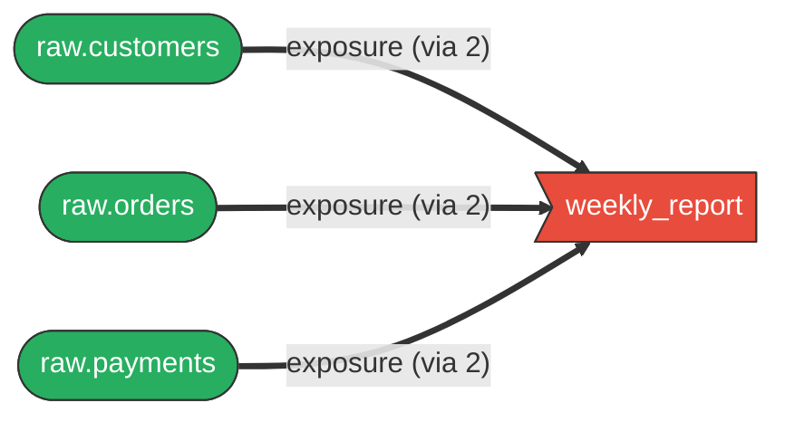
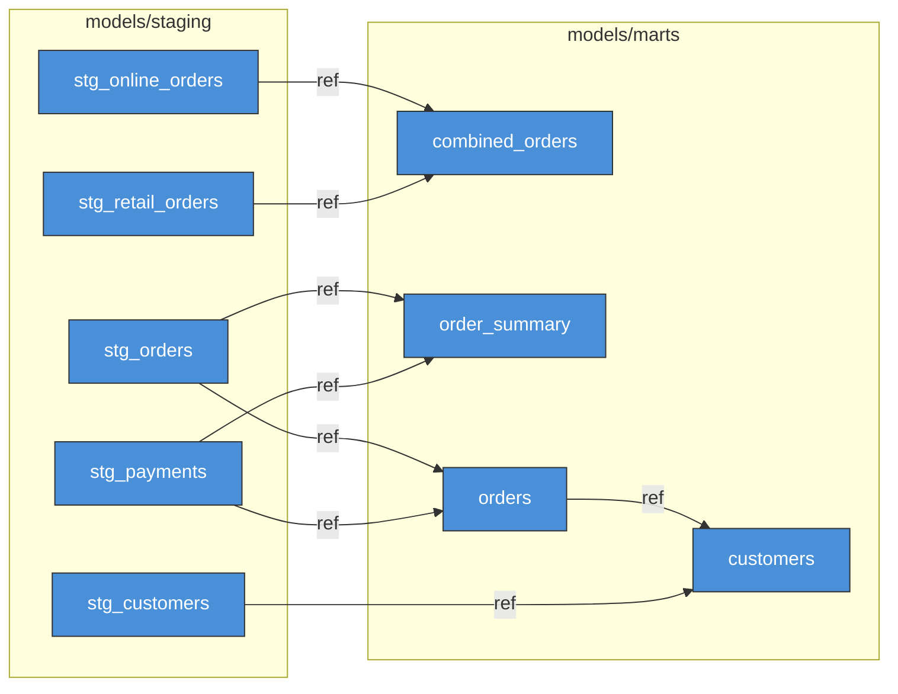

# dlin

dbt lineage analysis CLI that parses SQL files directly. No `dbt compile`, no Python, no `manifest.json`.

Builds a dependency graph from `ref()` and `source()` calls in SQL. Designed for AI agents and CI pipelines.

```sh
cargo install --git https://github.com/eitsupi/dlin.git
```

## Quick start

```sh
# Full lineage graph
dlin graph -p path/to/dbt/project

# Downstream impact analysis
dlin impact orders

# List models as JSON
dlin list -o json --json-fields unique_id,file_path

# Pipe changed files into lineage
git diff --name-only main | dlin graph -o json
```

## Why dlin?

dbt's built-in `dbt ls` and manifest-based tools require `dbt compile` (and therefore Python) before you can query the graph. dlin parses SQL directly, so it works anywhere Rust runs — in CI, in AI agents, or on a machine without Python installed.

- **No dependencies**: single binary, no Python, no `manifest.json`
- **Recursive upstream / downstream**: `-u N` / `-d N` to control traversal depth
- **Impact analysis with severity**: `dlin impact` scores downstream nodes and flags exposure reachability
- **Composable**: stdin accepts model names or file paths; pipe with `jq`, `dlin list`, `git diff`, etc.
- **Agent-friendly**: `--error-format json` emits structured `{"level","what","why","hint"}` on stderr; `--help` is designed for tool discovery

## Mermaid diagrams

dlin outputs Mermaid flowcharts that render natively on GitHub, GitLab, Notion, and other Markdown environments.

### Simplified graphs with `--node-type`

Skip intermediate models to see the big picture. When `--node-type` removes nodes, transitive edges are preserved automatically:

```sh
# Which sources feed into which exposures? (all intermediate models removed)
dlin graph --node-type source,exposure -o mermaid
```



### Pipe to build focused diagrams

Combine `dlin list`, `jq`, and `dlin graph` to extract exactly the nodes you want:

```sh
# Staging models → 1 hop downstream, models only, grouped by directory
dlin list -s 'path:models/staging' -o json | jq -r '.[].label' |
  dlin graph -d 1 --node-type model --group-by directory -o mermaid
```



### Other graph options

```sh
dlin graph orders -u 2 -d 1                    # focus on specific model
dlin graph -o mermaid --group-by node-type     # group by source/model/test/...
dlin graph -o mermaid --direction tb           # top-to-bottom layout
dlin graph -o dot | dot -Tsvg > out.svg        # Graphviz rendering
```

Output formats: ASCII (default), JSON, Mermaid, Graphviz DOT, Plain, SVG, HTML.

## Key subcommands

### `list`

```sh
dlin list                                                   # all models and sources
dlin list orders -o json --json-fields unique_id,file_path  # specific model as JSON
dlin list --node-type source                                # sources only
```

### `impact`

```sh
$ dlin impact orders
Impact Analysis: orders
==================================================
Overall Severity: CRITICAL

Summary:
  Affected models:    1
  Affected tests:     1
  Affected exposures: 1

Impacted Nodes:
  [critical] weekly_report (exposure, distance: 1)
  [high    ] customers (model, distance: 1) [models/marts/customers.sql]
  [low     ] assert_orders_positive_amount (test, distance: 1)
```

## Filtering

```sh
dlin graph -s tag:finance,path:marts  # selector expressions (union)
dlin graph --node-type model,source   # filter by node type
```

## Data sources

**SQL parsing (default)**: extracts `ref()` and `source()` from SQL via regex + Jinja template evaluation. No Python or dbt needed.

**Manifest mode** (`--source manifest`): reads a pre-compiled `manifest.json` for full accuracy with complex Jinja logic.

### Limitations of SQL parse mode

- `var()` resolves from `dbt_project.yml` only (`--vars` CLI overrides not supported)
- Runtime context (`target.type`, `env_var()`) is not evaluated
- Conditional Jinja branches use default values; non-default paths may be missed

For full accuracy, use `--source manifest`.

## Credits

Hard fork of [dbt-lineage-viewer](https://github.com/sipemu/dbt-lineage-viewer) by Simon Muller (MIT license). The original focused on TUI-based exploration; dlin removes the TUI and targets non-interactive use: scripting, CI, and AI agents.

## License

MIT
